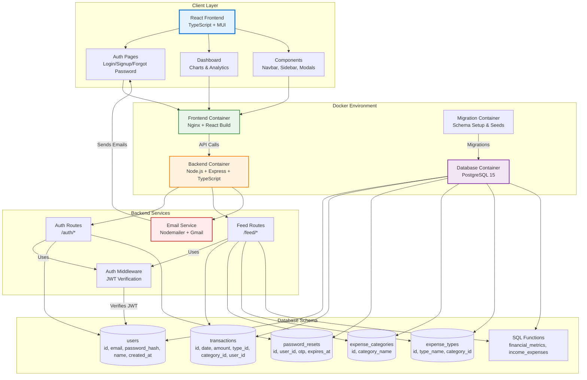
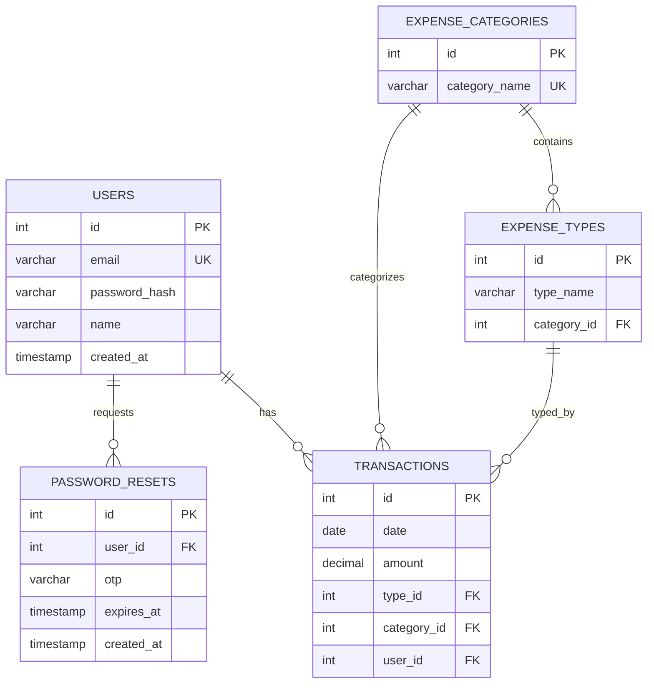

# 💰 Balance Board - Personal Finance Tracker

<div align="center">


**A modern, full-stack personal finance management platform with advanced analytics and email notifications**

[](https://frontend-production-80c5.up.railway.app)
[](LICENSE)

</div>

---

## 📹 Demo

> **See Balance Board in action**


---

## 🌟 Overview

**Balance Board** is a sophisticated, containerized personal finance management application designed to replace complex spreadsheets with an intuitive, secure, and feature-rich dashboard. Built with modern technologies and best practices, it provides real-time financial insights, automated email notifications, and comprehensive transaction tracking.

### 🎯 Key Highlights

- **🔐 Enterprise-Grade Security**: JWT authentication with 7-day sessions, bcrypt password hashing, and secure HTTP-only cookies
- **📧 Smart Email System**: Welcome emails, OTP-based password recovery, and account deletion confirmations
- **📊 Advanced Analytics**: Real-time charts and graphs with monthly/yearly breakdowns using Recharts
- **🎨 Modern UI/UX**: Responsive Material-UI design with dark mode support and intuitive navigation
- **🐳 Fully Containerized**: Docker Compose orchestration for seamless deployment and scalability
- **☁️ Production Ready**: Deployed on Railway with CI/CD pipeline and environment management

---

## ✨ Features

### 🔒 Authentication & Security
- **User Registration** with name, email, and secure password
- **JWT-based Authentication** with 7-day token expiry
- **Forgot Password** with OTP verification (10-minute expiry)
- **Account Deletion** with confirmation dialog and goodbye email
- **Session Management** with automatic logout on token expiration

### 💸 Transaction Management
- **Add Expenses** with type, category, amount, and date
- **Transaction History** with sorting and filtering
- **User-specific Data** with complete isolation and privacy
- **Real-time Updates** with automatic dashboard refresh

### 📈 Financial Analytics
- **Monthly Financial Overview** with key metrics display
- **Savings Rate Tracking** with visual percentage charts
- **Income vs Expense Analysis** with stacked bar charts
- **Category Breakdown** with pie/bar chart visualizations
- **Time-series Data** with monthly trend analysis

### 📧 Email Notifications
- **Welcome Email** on account creation with platform features
- **Password Reset OTP** with secure 6-digit code
- **Account Deletion Confirmation** with feedback option
- **Professional HTML Templates** with responsive design

### 🎨 User Experience
- **Responsive Dashboard** optimized for desktop, tablet, and mobile
- **Empty State Handling** with helpful onboarding messages
- **Loading States** with Material-UI skeleton components
- **Error Handling** with user-friendly error messages
- **Profile Management** with name display in avatar

---

## 🏗️ System Architecture



### 🔄 Request Flow

1. **Client Request** → React app sends API request
2. **Nginx Proxy** → Routes to backend container
3. **Auth Middleware** → Validates JWT token
4. **Controller** → Processes business logic
5. **Service Layer** → Interacts with database
6. **Database** → PostgreSQL with optimized queries
7. **Response** → JSON data back to client
8. **Email Service** → Asynchronous email sending

---

## 📊 Data Model

### Entity-Relationship Diagram



### 📋 Table Descriptions

| Table | Purpose | Key Fields |
|-------|---------|------------|
| **users** | User accounts and authentication | `id`, `email` (unique), `password_hash`, `name`, `created_at` |
| **transactions** | All income and expense records | `id`, `date`, `amount`, `type_id`, `category_id`, `user_id` |
| **password_resets** | OTP tokens for password recovery | `id`, `user_id`, `otp`, `expires_at` (10 min) |
| **expense_categories** | High-level groupings | `id`, `category_name` (e.g., Housing, Food) |
| **expense_types** | Specific transaction types | `id`, `type_name` (e.g., Rent, Groceries), `category_id` |

### 🔧 SQL Functions

- **`financial_metrics(user_id)`**: Calculates total income, expenses, savings rate
- **`income_expenses(user_id)`**: Monthly breakdown of income vs expenses
- **Automatic Indexing**: Foreign keys and frequently queried columns

---

## 🚀 Setup & Installation

### Prerequisites

- **Docker** (20.10+) & **Docker Compose** (v2+)
- **Node.js** (18+) for local development
- **Gmail Account** with App Password (for email features)

### 📦 Quick Start

1. **Clone the repository:**
   ```bash
   git clone https://github.com/ParminderSinghGithub/Balance-Board.git
   cd Balance-Board
   ```

2. **Configure environment variables:**
   ```bash
   cp .env.example .env
   ```
   
   Edit `.env` and add your credentials:
   ```env
   # Database
   POSTGRES_USER=postgres
   POSTGRES_PASSWORD=your_secure_password
   POSTGRES_DB=tracker
   
   # JWT Secret (generate a strong random string)
   JWT_SECRET=your_super_secret_jwt_key
   
   # Email Configuration (Gmail)
   EMAIL_USER=your-email@gmail.com
   EMAIL_PASSWORD=your-16-char-app-password
   FRONTEND_URL=http://localhost:3001
   ```

3. **Start the application:**
   ```bash
   docker-compose up -d
   ```
   
   To rebuild after code changes:
   ```bash
   docker-compose up --build -d
   ```

4. **Access the application:**
   - **Frontend**: [http://localhost:3001](http://localhost:3001)
   - **Backend API**: [http://localhost:8000](http://localhost:8000)
   - **Database Admin**: [http://localhost:8080](http://localhost:8080) (Adminer)

5. **Stop the application:**
   ```bash
   docker-compose down
   
   # To also remove volumes (database data):
   docker-compose down -v
   ```

### 🔐 Gmail App Password Setup

For email features to work, you need a Gmail App Password:

1. Enable **2-Factor Authentication** on your Gmail account
2. Go to [Google Account Security](https://myaccount.google.com/security)
3. Click **App passwords** → **Mail** → **Other (Custom name)**
4. Enter "Balance Board" and click **Generate**
5. Copy the 16-character password (remove spaces)
6. Add to `.env` as `EMAIL_PASSWORD`

---

## 💻 Usage

### 👤 Getting Started

1. **Sign Up**: Create an account with your name, email, and password
2. **Check Email**: Receive a welcome email with platform overview
3. **Login**: Access your personal dashboard
4. **Add Expenses**: Click the **+** button to add transactions
5. **View Analytics**: Monitor your financial health with charts

### 🔑 Features Guide

#### Adding Transactions
```
Click + Button → Select Type → Select Category → Enter Amount → Submit
```

#### Forgot Password
```
Login Page → Forgot Password → Enter Email → Check Email for OTP → 
Enter OTP + New Password → Login with new credentials
```

#### Delete Account
```
Click Avatar → Delete Account → Confirm → Check Email for goodbye message
```

#### Dashboard Navigation
- **Financial Overview**: Monthly metrics and savings rate
- **Expense/Income Chart**: Visual comparison of cashflow
- **Category Breakdown**: Where your money goes
- **Transaction List**: Complete history with filters

---

## 🛠️ Tech Stack

### Frontend
- **React 18** - Modern UI library with hooks
- **TypeScript** - Type-safe development
- **Material-UI 5** - Component library with theming
- **Recharts** - Data visualization library
- **React Router 6** - Client-side routing

### Backend
- **Node.js 18** - JavaScript runtime
- **Express 4** - Web application framework
- **TypeScript** - Type-safe server code
- **JWT** - Secure authentication tokens
- **bcryptjs** - Password hashing
- **Nodemailer** - Email sending
- **Zod** - Schema validation

### Database
- **PostgreSQL 15** - Relational database
- **pg** - PostgreSQL client for Node.js
- **Custom SQL Functions** - Advanced queries

### DevOps
- **Docker** - Containerization
- **Docker Compose** - Multi-container orchestration
- **Nginx** - Frontend web server
- **Railway** - Cloud deployment platform

---

## 📁 Project Structure

```
Balance-Board/
├── client/                    # React Frontend
│   ├── public/
│   ├── src/
│   │   ├── components/        # Reusable UI components
│   │   ├── context/          # React Context (Auth)
│   │   ├── pages/            # Page components
│   │   │   ├── cashflow/     # Dashboard with Row1, Row2
│   │   │   ├── login/        # Login/Signup page
│   │   │   ├── forgot-password/ # Password reset
│   │   │   ├── navbar/       # Top navigation
│   │   │   └── sidebar/      # Side navigation
│   │   ├── theme.ts          # MUI theme configuration
│   │   ├── utils/            # Helper functions (apiFetch)
│   │   └── App.tsx           # Main app component
│   ├── Dockerfile
│   └── package.json
│
├── server/                    # Node.js Backend
│   ├── src/
│   │   ├── controllers/      # Request handlers
│   │   │   └── auth.controller.ts
│   │   │   └── feed.controller.ts
│   │   ├── routes/           # API endpoints
│   │   │   └── auth.ts       # /auth routes
│   │   │   └── feed.ts       # /feed routes
│   │   ├── services/         # Business logic
│   │   │   ├── auth.service.ts
│   │   │   ├── feed.service.ts
│   │   │   └── email.service.ts
│   │   ├── middleware/       # Auth middleware
│   │   │   └── is-auth.ts
│   │   ├── db_conn/          # Database connection
│   │   ├── app.ts            # Express app setup
│   │   └── types/            # TypeScript types
│   ├── Dockerfile
│   └── package.json
│
├── database/                  # Database Setup
│   ├── migrations/           # Schema migrations
│   │   ├── 001_create_base_tables.sql
│   │   ├── 002_add_users_table.sql
│   │   ├── 003_create_financial_metrics_function.sql
│   │   ├── 004_create_income_expense_function.sql
│   │   ├── 005_add_name_to_users.sql
│   │   └── 006_create_password_resets_table.sql
│   ├── seeds/                # Initial data
│   │   ├── 001_categories_and_types.sql
│   │   └── 002_test_transactions.sql
│   ├── src/                  # Migration runner
│   ├── Dockerfile
│   └── package.json
│
├── docker-compose.yml         # Container orchestration
├── railway.json              # Railway deployment config
├── .env.example              # Environment template
└── LICENSE                   # MIT License
```

---

## 🌐 Deployment

### Railway Deployment (Recommended)

**Live Application**: [https://frontend-production-80c5.up.railway.app](https://frontend-production-80c5.up.railway.app)

#### Environment Variables (Railway Dashboard)

Add these to each service:

**Backend Service:**
```env
POSTGRES_HOST=<railway-provided>
POSTGRES_USER=postgres
POSTGRES_PASSWORD=<railway-generated>
POSTGRES_DB=railway
JWT_SECRET=<your-secret>
EMAIL_USER=<your-gmail>
EMAIL_PASSWORD=<app-password>
FRONTEND_URL=https://frontend-production-80c5.up.railway.app
NODE_ENV=production
PORT=8000
```

**Frontend Service:**
```env
REACT_APP_API_URL=https://backend-production-6d4c.up.railway.app
```

### Manual Deployment

1. **Build Docker images:**
   ```bash
   docker-compose build
   ```

2. **Push to container registry:**
   ```bash
   docker tag balance-board-frontend your-registry/frontend
   docker push your-registry/frontend
   ```

3. **Deploy to your infrastructure** (AWS, Azure, GCP, etc.)

---

## 🧪 Testing

### Local Testing

```bash
# Run backend tests
cd server
npm test

# Run frontend tests
cd client
npm test

# Test with Postman/Thunder Client
GET http://localhost:8000/feed/financial-overview
Authorization: Bearer <your-jwt-token>
```

### Database Access

**Adminer** (Web UI): http://localhost:8080
```
System: PostgreSQL
Server: warehouse
Username: postgres
Password: postgres
Database: tracker
```

**psql CLI**:
```bash
docker exec -it warehouse psql -U postgres -d tracker
```

---

## 🔧 Configuration

### Email Templates

Email templates are located in `server/src/services/email.service.ts`:
- `sendWelcomeEmail()` - Customizable welcome message
- `sendPasswordResetOTP()` - OTP email styling
- `sendAccountDeletionEmail()` - Goodbye message

### JWT Token Expiry

Default: 7 days (configurable in `auth.controller.ts`)
```typescript
{ expiresIn: '7d' } // Change to '1h', '30d', etc.
```

### Database Migrations

To add new migrations:
1. Create `007_your_migration.sql` in `database/migrations/`
2. Rebuild: `docker-compose up --build db_migrations`

---

## 🤝 Contributing

Contributions are welcome! Please follow these steps:

1. **Fork** the repository
2. **Create** a feature branch: `git checkout -b feature/AmazingFeature`
3. **Commit** your changes: `git commit -m 'Add AmazingFeature'`
4. **Push** to the branch: `git push origin feature/AmazingFeature`
5. **Open** a Pull Request

### Coding Standards
- **TypeScript** for type safety
- **ESLint** for code quality
- **Prettier** for formatting
- **Conventional Commits** for commit messages

---

## 📝 License

This project is licensed under the **MIT License** - see the [LICENSE](LICENSE) file for details.

---

## 📧 Contact & Support

**Developer**: Parminder Singh  
**GitHub**: [@ParminderSinghGithub](https://github.com/ParminderSinghGithub)  
**Live Demo**: [Balance Board](https://frontend-production-80c5.up.railway.app)

### Found a bug or have a feature request?
Please [open an issue](https://github.com/ParminderSinghGithub/Balance-Board/issues) with detailed information.

---

<div align="center">

**⭐ Star this repository if you find it helpful!**

Made with ❤️ using React, Node.js, PostgreSQL, and Docker

[🔝 Back to Top](#-balance-board---personal-finance-tracker)

</div>
